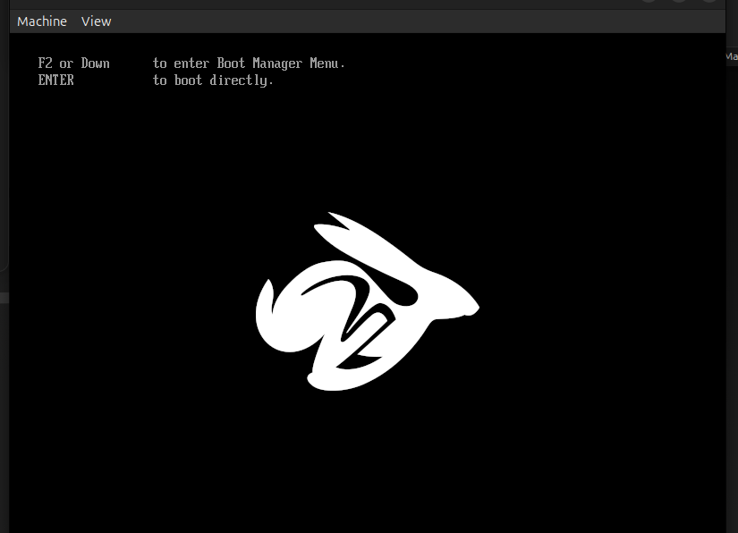
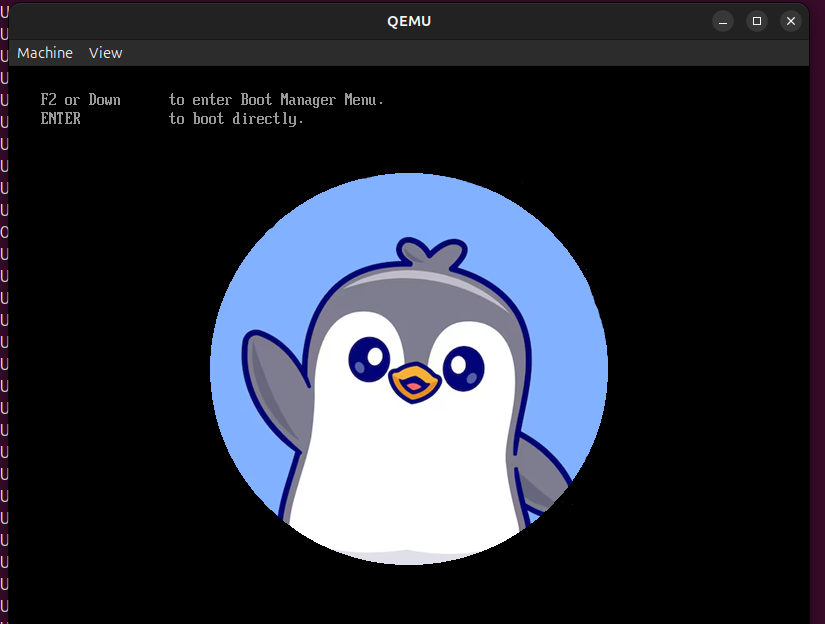

## To change the logo 



1. Go to : ``` make menuconfig```
2. Select PAYLOAD 
    - select edk2 Bootsplash path and filename
    - change the path and file name with your custom logo 

    

3. Add 24 Bit .BMP image file at this location : /coreboot/Documentation/ 

4. Save + OK + Exit 

5. make the build again 
   run : ```make```

6. Test the build in qemu 

7. 

- successfully changed the logo 