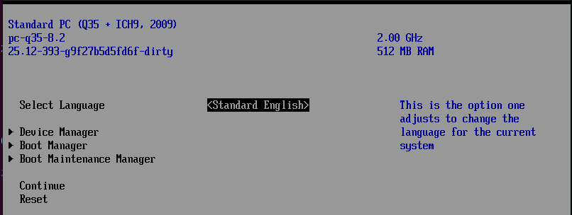
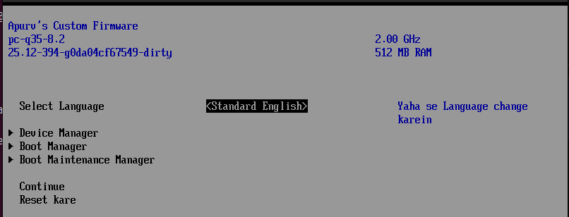

## Customize the Setup Page 



- To make changes on this front page got to 
``` /coreboot/payloads/external/edk2/workspace/tianocore/MdeModulePkg/Application/UiApp ```

- Make the required changes in ``` FrontPageStrings.uin``` file 
- Also add the newly added strings to ``` FrontPageVfr.Vfr ``` file 

outcome : 

