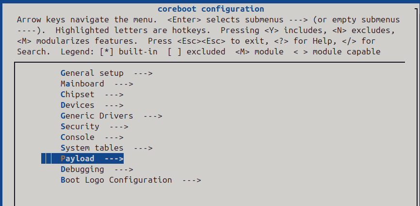
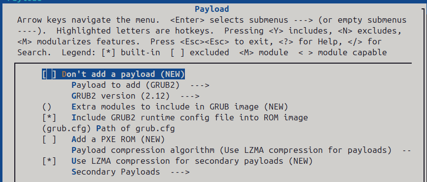
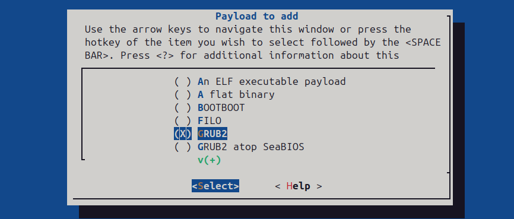
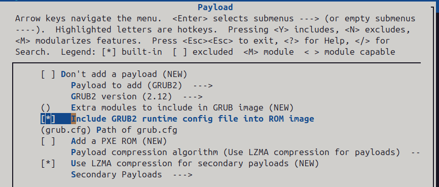
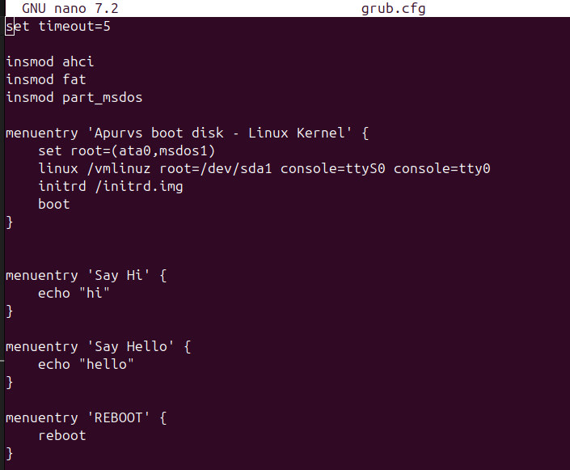
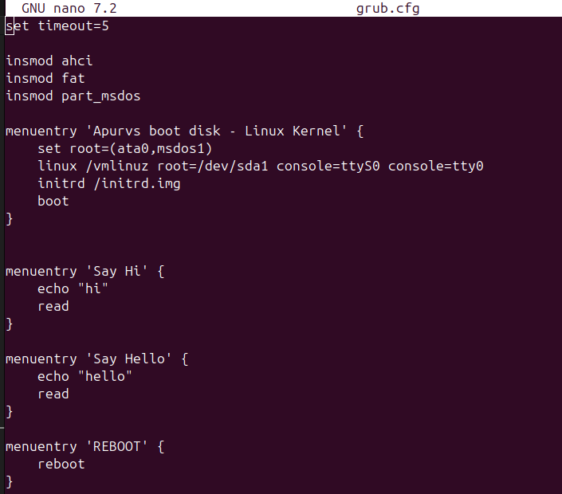
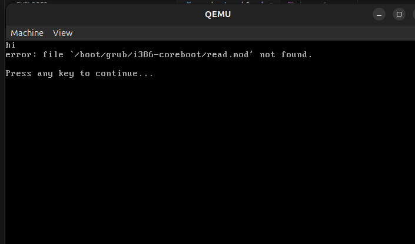
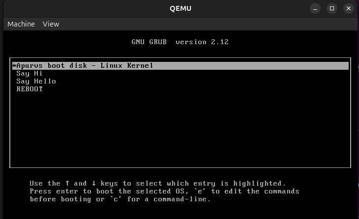
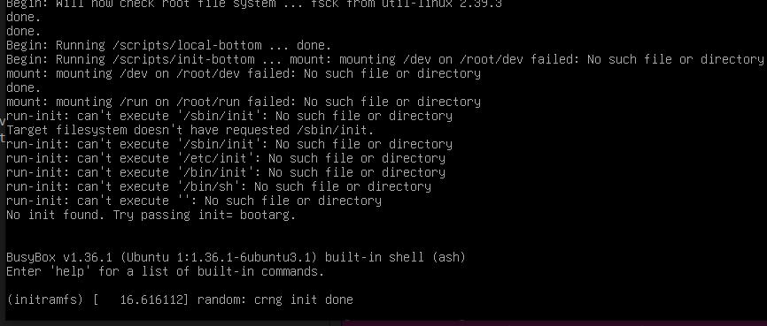
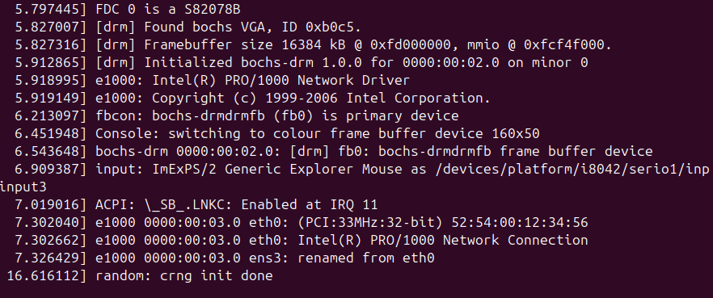

# Coreboot - GRUB 2 BUILD DOCS 

## 1. Install the dependencies 


```
sudo apt-get install -y bison build-essential curl flex git gnat libncurses-dev libssl-dev zlib1g-dev pkgconf
```

## 2. Download Coreboot from git
```
git clone https://review.coreboot.org/coreboot
cd coreboot
```
alt text
## 3. Build the coreboot toolchain

```
make help_toolchain

make crossgcc-i386 CPUS=$(nproc)       # build i386 toolchain 

``` 
- the ``` make crossgcc-i386 ``` builds cross-compiler required by coreboot to produce firmware binaries 

## 4.  Build the payload - coreinfo

```
make -C payloads/coreinfo olddefconfig
make -C payloads/coreinfo

```

## 5. Configure the build

```
make menuconfig
```


1. Go to Payload 



2. Select Payload to add 

 

3. Select GRUB 2 - payload



4. Add a .cfg file - select Include GRUB2 runtime config file into ROM image

  

5. Add path of the .cfg file

6. SAVE + EXIT 

## 6. Check Configuration 

```
make savedefconfig
cat defconfig
```
## 7. Build Coreboot

```
make
```


## add a grub.cfg file in the folder 




- Learnings
    - we added the menu entry as say Hi but we cant see it because grub executes the the ``` echo ``` command so fast that we see the boot menu immediately 
    - to see the output we can use ``` read ``` command at the end 
    - ``` reboot ``` command is used to restart the boot menu



- output 



##  TEST

### provide the virtual bootable disk image to the qemu 

```
qemu-system-x86_64 -bios build/coreboot.rom   -drive file=/home/apurv-pt8167/Desktop/gbootloader/grub/fat_disk.img,if=ide,format=raw   -m 2G -serial mon:stdio
```


Output : 

- youll see a boot menu 



kernel handover : 
- GRUB SHELL



- Terminal



## Boot Flow 
```
- coreboot.rom

    - GRUB2 Payload

        - grub.cfg (-boot menu configuration file)

            - Boot Menu 